

<!-- BUSINESS:START -->

<!-- BUSINESS:END -->

### 💫 About Me

Hi, I'm <strong>Sruthi</strong>. I build small web apps and work at the intersection of <em>data analytics, machine learning, and optimization</em>, with a focus on neuroscience-backed learning, biological research and clinical trials.   By day, I work in clinical research focused on oncology. On the side, I'm the founder &amp; CEO of <strong>tutoringwithsruthi</strong>, and I'm currently building <strong>Maie</strong>, an upcoming vertical SaaS platform for solo tutors and small tutoring businesses - an all-in-one tool for managing students, scheduling, payments, content, payroll, and more, powered by neuroscience-backed ML.

- Currently leveling up my full-stack skills. Open to advice!
- Open to collaboration on edtech, ML, and clinical research projects.

> 🌱 currently planting new ideas

### 💻 Tech Stack

<!-- STACK:START -->
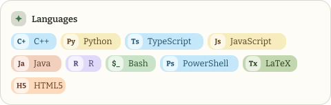
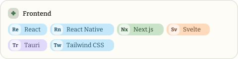
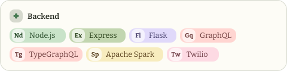
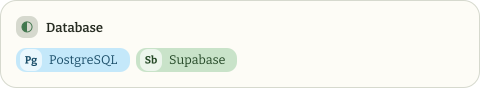
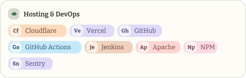
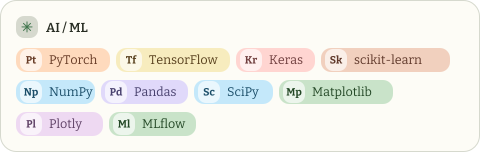
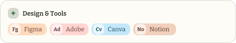
<!-- STACK:END -->

### 📊 GitHub Stats

<!-- STATS:START -->
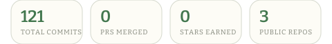

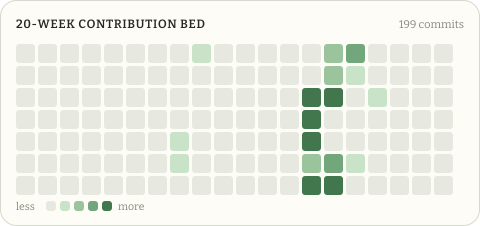

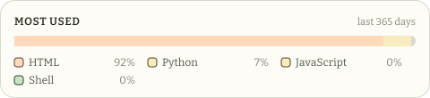
<!-- STATS:END -->

### 🌾 Harvested

<!-- HARVESTED:START -->
<a href="https://tutoringwithsruthi.com">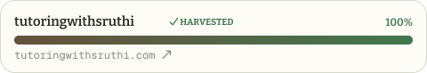</a>

<a href="https://solari.astrifera.app">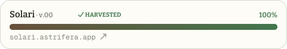</a>
<!-- HARVESTED:END -->

### 🌿 Currently Growing

<!-- GROWING:START -->
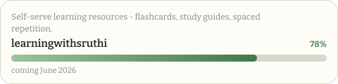

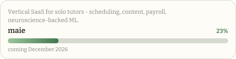

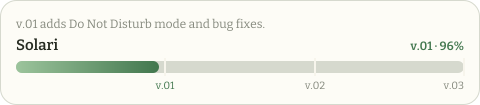
<!-- GROWING:END -->

### ✍️ Garden Notes

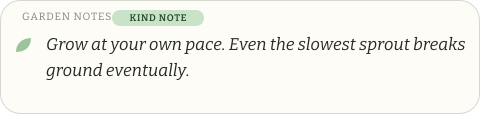

### 🔝 Top Repos

<!-- REPOS:START -->
| Repo | Description | Languages | ★ |
| --- | --- | --- | --- |
| vsruthi00 / maie 🔒 | Vertical SaaS for solo tutors and small tutoring businesses. | HTML, JavaScript, CSS, SQL | · |
| vsruthi00 / solari 🔒 | A flipboard-style app for staying close to the people you love. | TypeScript, SQL, HTML, CSS | · |
| [vsruthi00 / cli-buddies](https://github.com/vsruthi00/cli-buddies) | Pixel-art companions that live in a tmux pane while you code. | Python, Shell | 0 |
<!-- REPOS:END -->

---

 · thanks for stopping by 🌿
